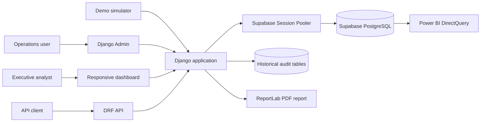

# Rice Enterprise Operations Dashboard

A Django-based rice inventory and fulfillment dashboard backed by Supabase PostgreSQL. The project provides:

- Inventory batch tracking with dynamic expiry classification.
- Orders, deliveries, and payment records managed through Django admin.
- A responsive operations dashboard at `/`.
- A Supabase-compatible ETL metrics job.
- Power BI DirectQuery guidance for executive reporting.
- Django REST Framework endpoints, audit history, RBAC bootstrap, and a ReportLab PDF report.

## Architecture




The central login screen is available at `/login/`. After successful authentication, the group determines the destination:

## Requirements

- Python 3.14 or compatible Python version.
- A Supabase project with PostgreSQL access.
- The project virtual environment in `env/`, or a newly created virtual environment.

## Configuration

Copy `.env.example` to `.env` and set the real database password. For the Mumbai Supabase project used by this workspace, the Session Pooler format is:

```env
DB_NAME=postgres
DB_USER=postgres.nuffdhsbwsjlxsivzogs
DB_PASSWORD=your-database-password
DB_HOST=aws-0-ap-south-1.pooler.supabase.com
DB_PORT=5432
DB_SSLMODE=require
```

The `SUPABASE_*` values are available for API/auth integrations. The publishable key may be used by browser clients; never expose `SUPABASE_SECRET_KEY` in browser code.

`.env` is ignored by Git. Never commit database passwords, secret keys, or service-role credentials. Rotate any credential that has been exposed.

## Install and migrate

```powershell
.\env\Scripts\python.exe -m pip install -r requirements.txt
.\env\Scripts\python.exe manage.py check
.\env\Scripts\python.exe manage.py migrate
.\env\Scripts\python.exe manage.py setup_roles
```

Create an admin account when needed:

```powershell
.\env\Scripts\python.exe manage.py createsuperuser
```

Run locally:

```powershell
.\env\Scripts\python.exe manage.py runserver 127.0.0.1:8000
```

Open `http://127.0.0.1:8000/` for the dashboard or `/admin/` for administration.

Download the current operations summary at `http://127.0.0.1:8000/reports/operations.pdf`.

## Roles and audit trail

After migrations, `setup_roles` creates or updates:

- **Super Admin**: inventory, orders, deliveries, payments, users, and groups.
- **Warehouse Manager**: inventory batch create/read/update/delete.
- **Logistics Coordinator**: delivery create/read/update/delete and status scheduling.
- **Sales & Billing Clerk**: order and payment create/read/update/delete.

Assign groups to users in Django Admin. Django’s schema migrations remain a deployment responsibility; group permissions do not grant arbitrary code or migration execution.

Every core model has `HistoricalRecords()`. Changes are stored in `HistoricalInventoryBatch`, `HistoricalOrder`, `HistoricalDelivery`, and `HistoricalPayment`, including the request user when a change is made through an authenticated request.

## API

The DRF endpoints are available at:

```text
/api/batches/
/api/orders/
/api/deliveries/
/api/payments/
```

Unauthenticated clients can read records. Writes require authentication. Use Django session authentication in the browser or add a production token/OAuth policy before exposing the API externally.

## Live demo simulator

Run one safe transaction for a smoke test:

```powershell
.\env\Scripts\python.exe jobs\simulator.py --once
```

Run continuous demo activity every 10 seconds:

```powershell
.\env\Scripts\python.exe jobs\simulator.py --interval 10
```

Stop continuous mode with `CTRL+C`. Each cycle deducts a locked inventory quantity, creates an order, schedules a pending delivery, and creates an unpaid payment. The low-stock signal logs a warning when a batch crosses below 5,000 kg.

## Project map

- `config/settings.py`: dotenv loading, database, Django configuration.
- `inventory/models.py`: inventory, orders, deliveries, and payments.
- `inventory/admin.py`: operational admin lists and computed stock filter.
- `inventory/views.py`: dashboard aggregates and date filtering.
- `inventory/templates/inventory/dashboard.html`: responsive dashboard UI.
- `jobs/update_metrics.py`: standalone pandas/SQLAlchemy metrics job.
- `jobs/simulator.py`: transaction-safe live demo data generator.
- `inventory/management/commands/setup_roles.py`: RBAC group bootstrap.
- `inventory/signals.py`: low-stock transition alert.
- `inventory/migrations/0002_historicaldelivery_historicalinventorybatch_and_more.py`: audit tables.

## Operations portal

Authenticated staff use `/workstation/` for the role-aware operational UI. It provides:

- Customer CRM directory at `/customers/`, including order counts and profile editing.
- New batch intake at `/batches/new/`.
- Audited stock adjustments at `/stock-adjustments/new/`; quantities cannot become negative.
- Atomic order booking at `/orders/new/`, which checks available rice by variety and creates the Order, Delivery, and Payment together.
- Task assignment and status updates at `/tasks/new/` and `/tasks/<id>/edit/`. Administrators can manage any task; assigned staff can update their own task, including marking it completed.

Write access is protected by Django model permissions. Sales and billing permissions are required for CRM/order/payment workflows, while inventory batch and stock adjustment permissions are required for warehouse actions. Hiding a button in the UI is only a convenience; the server-side permission checks are authoritative.

## Three-entity routing

Run `setup_roles` to create the canonical groups:

- **Super Admin / Client**: `/` executive analytics, `/admin/` full RBAC/schema/audit administration, and the PDF report.
- **Team Lead**: `/tl/dashboard/` CSR performance, escalations, and pending stock approvals; `/tasks/new/`; `/batches/new/`.
- **CSR Agent**: `/workstation/` personal operations, `/customers/` CRM, `/calls/new/` call logging, and `/orders/new/` order booking.

The entity middleware exposes `request.entity_role` to templates. The role decorator is the authoritative route guard; a user must be authenticated and belong to the required group, except a Django superuser who has emergency access.

The REST API uses `DjangoModelPermissions` as well. This prevents a CSR Agent from changing inventory or stock-adjustment records by calling the API directly.

`CallLog` stores inbound/outbound calls, purpose, summary, follow-up dates, and TL escalation notes. `StockAdjustment` stores the request user, signed quantity, approval state, and approving Team Lead. A pending adjustment does not alter inventory; approval applies it inside a row lock and rejects negative resulting stock.

## Separate user credentials

Create one account per person and assign one role. Passwords are entered interactively and are never stored in commands, source files, or documentation:

```powershell
.\env\Scripts\python.exe manage.py setup_roles
.\env\Scripts\python.exe manage.py create_role_user --username tl_asha --email asha@example.com --role "Team Lead"
.\env\Scripts\python.exe manage.py create_role_user --username csr_rahul --email rahul@example.com --role "CSR Agent"
.\env\Scripts\python.exe manage.py create_role_user --username client_acme --email operations@acme.example --role "Customer"
.\env\Scripts\python.exe manage.py create_role_user --username superadmin --role "Super Admin / Client" --superuser
```

Login destinations are role-specific: Team Leads go to `/tl/dashboard/`, CSR Agents go to `/workstation/`, Customers go to `/portal/`, and Super Admin / Client goes to `/`. CSR task data is limited to the logged-in agent. The Super Admin / Client role retains cross-area access by design.

The login screen includes a two-week `Remember me` session option, access-request guidance, and an interactive compliance dialog covering privacy, call-recording consent, and role-scoped access. The CSR workstation includes a responsive hamburger drawer and a floating softphone quick logger. Quick call records capture customer, call type, notes, duration, and consent without leaving the workstation.
- `docs/data_model.md`: schema and business rules.
- `docs/operations.md`: runbook and troubleshooting.
- `docs/powerbi_dashboard.md`: DAX and Power BI visual specification.

## Validation

```powershell
.\env\Scripts\python.exe manage.py check
.\env\Scripts\python.exe -m py_compile inventory\models.py inventory\admin.py jobs\update_metrics.py
.\env\Scripts\python.exe manage.py makemigrations --check --dry-run
```

The ETL job requires a reachable Supabase database:

```powershell
.\env\Scripts\python.exe jobs\update_metrics.py
```

## Power BI DirectQuery

1. Open Power BI Desktop and choose **Get data > PostgreSQL database**.
2. Use the Supabase Session Pooler host and port from `.env`; use database `postgres`, user `postgres.<project-ref>`, and the database password.
3. Select DirectQuery and load `inventory_inventorybatch`, `inventory_order`, `inventory_delivery`, and `inventory_payment`.
4. Relate deliveries and payments to orders through `order_id`.
5. Add the DAX measures and Corporate Blue visual specification from [docs/powerbi_dashboard.md](docs/powerbi_dashboard.md).

The Power BI table names reflect Django’s default naming. They are not the same as the illustrative names `inventory_batches`, `deliveries`, and `payments` sometimes used in prompts.
